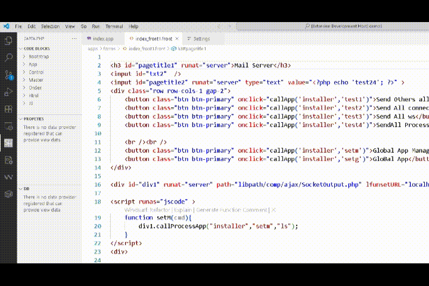
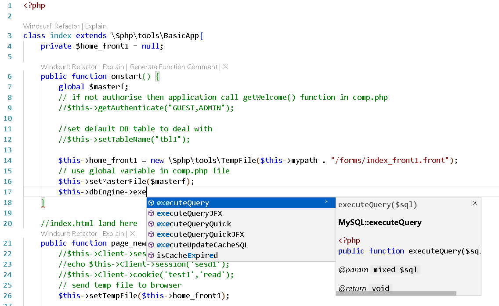
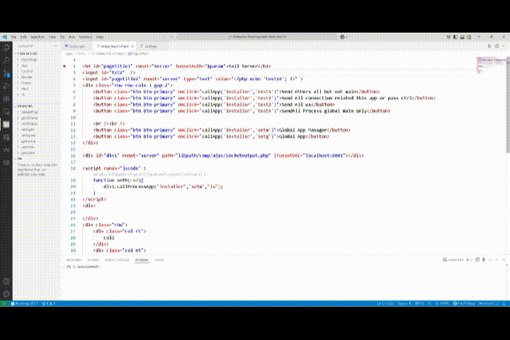
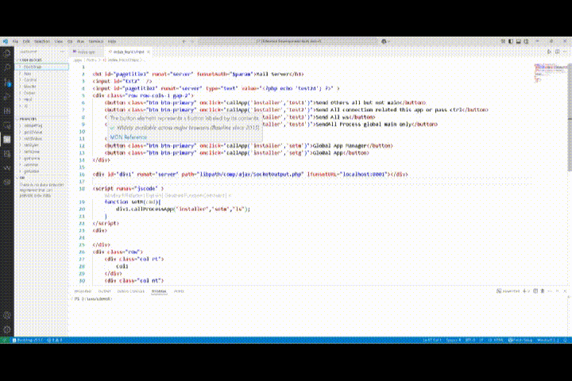

<h1 align="center">SartajPHP + PHP IntelliSense</h1>

    

This extension provides [SartajPHP](https://sartajphp.com/) support for 
SartajPHP Framework, php development + IntelliSense for Visual Studio Code.
For Discussion [Join the chat](https://gitter.im/sartajphp/community)

## Installation

Add File Association for app, use vs code menu file->preferences->settings and search. 
"files.associations": {
        "*.app": "php",
        "*.front": "html",
        "*.sphp": "json"
    }

You may also need to install SphpDesk runtime from [Download SphpDesk](https://www.sartajphp.com/index-info-downloads.html) for some extra features like design view and run app.
if you don't have install SphpDesk on standard path or use nodejs package sphpdesk then setup php and sphpserver executeables path. set sphpserver path in

php.sphpExecutablePath : "C:/sphpdesk/sphpserver/sphpserver-win.exe" 
 or on linux it is sphpserver-linux file.
setting to run SphpServer App.

Install SphpServer(For run SartajPhp App in nodejs) with sphpdesk npm package

npm install -g sphpdesk

<a href="https://www.npmjs.com/package/sphpdesk">https://www.npmjs.com/package/sphpdesk</a>

Without Sphpdesk(Design View not work):-
You need at least PHP 5.6 installed for the extension to work. You can either add it to your PATH or set the `php.executablePath` setting. Install SartajPhp Framework with composer and set start.php path to framework.

**Note: Php Autocomplete engine droped So use PHP Intelephense or any other.**

I recommend to disable VS Code's built-in PHP IntelliSense by setting `php.suggest.basic` to `false` to avoid duplicate suggestions. Add res/Score/SphpDoc and res/Slib folder intelephense.environment in VS Code Settings for Autocomplete Help. 

## Key Binding and Commands

Run:- F7 , It detects settings from app.sphp if not available then run as console app

Stop:- Ctrl+Alt+s Stop Running Project or use CTRL + C if running in terminal

Create Project:- First open empty folder and run Command SartajPHP:create with ctrl+shift+p 

Create Phar Pacakge:- run Command SartajPHP:dist with ctrl+shift+p

## Todo

- SartajPHP Auto Complete Intellisense - Done
- PHP Auto Complete Intellisense - Removed use other extension 
- Run DeskApp in SphpServer - Done
- Run Server App - Done
- Run Console App - Done
- Add SphpServer (Install Sphpdesk From sartajphp website or NPM package) Support - Done
- Generate Phar file - Done
- Run Phar file (Need Sphpdesk NPM package installed on machine with global flag) - Done
- Run WebApp in browser - Done
- Run App Events under cursor - Nop
- TempFile Design Support - Done
- TempFile Autocomplete - Done
- Master Designer Support - Done
- New Project Generator Done

### Code Completion Front

### Signature Help

### Code Completion Help SartajPhp App

### Visual Designer

### Code Blocks Help

## Credits

[SartajPHP Intellisense](https://www.sartajphp.com)
[SartajPHP Website](https://www.sartajphp.com)
